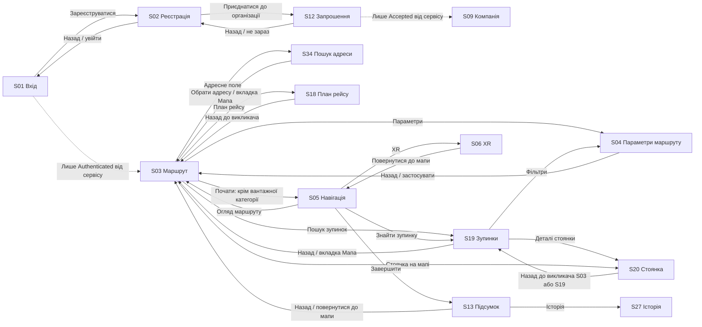
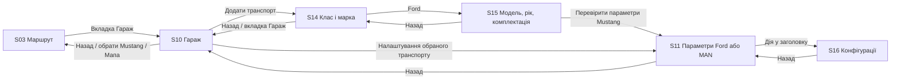
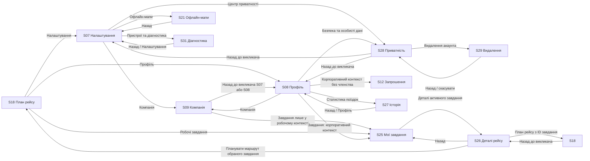

# Екрани та переходи XRNavi

Стан документа: 6 жовтня 2026 року, після рефакторингу Clean Architecture + MVVM.

Джерело класифікації: [схема екранів у Figma](https://www.figma.com/design/atSi2dQTrI7763POEO2w1a/XRNavi?node-id=59-5961).
Джерело фактичних переходів: [ScreenHost.kt](shared/src/commonMain/kotlin/com/mobilespace/xrnavi/presentation/ui/ScreenHost.kt), [AppNavigator.kt](shared/src/commonMain/kotlin/com/mobilespace/xrnavi/presentation/navigation/AppNavigator.kt) та ефекти екранних ViewModel.

## Обсяг і статус

| Категорія у схемі | Кількість | Наявність UI |
|---|---:|---|
| Основні | 9 | 9 із 9 |
| Допоміжні, у Figma — «уточнюючі» | 18 | 18 із 18 |
| Стани | 7 | Не рахуються як самостійні екрани |
| Основні та допоміжні разом | 27 | 27 із 27 |

Наявність UI не означає готовність сервісів, точну відповідність кожної деталі макету або завершеність навігації.
Документ описує поточний код. Навігаційний стек і спільний стан перевіряються автоматизованими Kotlin-тестами; повне проходження всіх UI-сценаріїв на пристроях не виконувалося.

Спільний інтерфейс реалізовано в Compose Multiplatform для Android та iOS. Екрани використовують `ApexTheme`, спільні кольори й `LabelText`; ресурси розташовані в `shared/src/commonMain/composeResources`.

## Основні екрани

| ID | Назва за схемою | Призначення та вміст | Реалізація / destination |
|---|---|---|---|
| S01 | Вхід · APEX Drive | Електронна пошта, пароль, показ пароля, відновлення доступу, Apple / Google, реєстрація та корпоративний вхід. Введення перевіряється; реальна авторизація не підключена. | [AuthenticationScreens.kt](shared/src/commonMain/kotlin/com/mobilespace/xrnavi/presentation/ui/AuthenticationScreens.kt), `SignInScreen` / `SignIn` |
| S03 | Маршрут · Ford Mustang | Планування маршруту: початок і призначення, ілюстративна мапа, вибір категорії транспорту, параметри маршруту, зупинки, план рейсу та старт навігації. Для вантажного транспорту показується повідомлення про недоступну перевірку. | [RouteScreen.kt](shared/src/commonMain/kotlin/com/mobilespace/xrnavi/presentation/ui/RouteScreen.kt) / `Route` |
| S05 | Навігація · Покроковий маршрут | Мапа активної поїздки, поточний і наступний маневри, смуги, швидкість, час прибуття, звук, огляд маршруту, XR і завершення поїздки. Геолокація та мапа демонстраційні. | [ActiveNavigationScreen.kt](shared/src/commonMain/kotlin/com/mobilespace/xrnavi/presentation/ui/ActiveNavigationScreen.kt) / `ActiveNavigation` |
| S06 | XR-навігація · Візуальний маршрут | Концепт візуальної навігації: фон камери, маршрут і маневр, швидкість, звук, дані поїздки та повернення до звичайної мапи. Реальні камера та XR не підключені. | [XrNavigationScreen.kt](shared/src/commonMain/kotlin/com/mobilespace/xrnavi/presentation/ui/XrNavigationScreen.kt) / `XrNavigation` |
| S07 | Налаштування · Особисті та успадковані | Особиста мова, вигляд мапи, голосові підказки та XR; успадковані правила організації. Вхід до корпоративних налаштувань, офлайн-мап, приватності та діагностики пристрою. Перемикачі змінюють спільні налаштування в пам'яті; це не запуск голосових або XR-сервісів. | [PreferencesScreen.kt](shared/src/commonMain/kotlin/com/mobilespace/xrnavi/presentation/ui/PreferencesScreen.kt) / `Preferences` |
| S08 | Профіль · Андрій Коваль | Дані профілю, особистий / корпоративний контекст, гараж, статистика поїздок, організація й приватність. У корпоративному контексті доступний перехід до завдань водія. Дані профілю демонстраційні. | [ProfileScreen.kt](shared/src/commonMain/kotlin/com/mobilespace/xrnavi/presentation/ui/ProfileScreen.kt) / `Profile` |
| S10 | Гараж · Вибір транспорту | Особистий Mustang і транспорт організації, категорії, відкриття параметрів, додавання транспорту та вибір авто для маршруту. Вибір транспорту передається через спільний `SessionRepository`; корпоративний MAN вимагає членства. | [GarageScreen.kt](shared/src/commonMain/kotlin/com/mobilespace/xrnavi/presentation/ui/GarageScreen.kt) / `Garage` |
| S25 | Робота · Завдання водія | «Мої завдання»: активні / завершені, закріплений MAN TGX, активне, нове й завершене завдання та пояснення робочої геолокації. Прийняття завдання потребує сервісу організації. | [WorkTasksScreen.kt](shared/src/commonMain/kotlin/com/mobilespace/xrnavi/presentation/ui/WorkTasksScreen.kt) / `WorkTasks` |
| S27 | Поїздки · Історія та класифікація | Особисті та робочі поїздки, фільтри, повідомлення про активний рейс і дія виправлення класифікації. Деталі й зміна класифікації недоступні без сервісу історії. | [TripHistoryScreen.kt](shared/src/commonMain/kotlin/com/mobilespace/xrnavi/presentation/ui/TripHistoryScreen.kt) / `TripHistory` |

## Допоміжні екрани

| ID | Назва за схемою | Призначення та вміст | Реалізація / destination |
|---|---|---|---|
| S02 | Реєстрація · Особистий акаунт | Ім'я, пошта, пароль, тип акаунта, згода з умовами, перевірка введення та перехід до запрошення організації. Реєстраційний сервіс не підключений. | [AuthenticationScreens.kt](shared/src/commonMain/kotlin/com/mobilespace/xrnavi/presentation/ui/AuthenticationScreens.kt), `RegistrationScreen` / `Registration` |
| S04 | Параметри маршруту · Автовоз | Категорія й профіль транспорту, габарити / маса, причіп, правила автопарку, альтернативні маршрути та відпочинок. Кнопка застосування переносить чернетку параметрів у спільний стан і повертає до викликача; звичайне повернення не застосовує чернетку. | [RouteSettingsScreen.kt](shared/src/commonMain/kotlin/com/mobilespace/xrnavi/presentation/ui/RouteSettingsScreen.kt) / `RouteSettings` |
| S09 | Компанія · Корпоративні налаштування | Політика Dnipro Logistics, заблоковані габарити, дороги й швидкість, особисто доступні налаштування та зв'язок з організацією. Правила показані як приклад, зміни адміністратора не імітуються. | [OrganizationSettingsScreen.kt](shared/src/commonMain/kotlin/com/mobilespace/xrnavi/presentation/ui/OrganizationSettingsScreen.kt) / `OrganizationSettings` |
| S11 | Транспорт · Габарити та обмеження | Особистий Ford або корпоративний MAN TGX відповідно до обраного транспорту: параметри Ford, затверджені габарити MAN, фактична маса, обмеження маршрутизації, збереження та запит диспетчеру. Для маси є перевірка введення; збереження не підключено. | [VehicleProfileScreen.kt](shared/src/commonMain/kotlin/com/mobilespace/xrnavi/presentation/ui/VehicleProfileScreen.kt) / `VehicleProfile` |
| S12 | Організація · Прийняття запрошення | Код і адресат запрошення, організація, межі управління даними, згода з правилами, прийняття або відмова. Перехід після прийняття залежить від результату сервісу. | [OrganizationInvitationScreen.kt](shared/src/commonMain/kotlin/com/mobilespace/xrnavi/presentation/ui/OrganizationInvitationScreen.kt) / `OrganizationInvitation` |
| S13 | Поїздка · Підсумок маршруту | Завершений маршрут, дата, час і відстань, рух / зупинки, транспорт, пояснення історії, поширення та повернення до мапи. Підсумок демонстраційний, поширення не підключене. | [TripSummaryScreen.kt](shared/src/commonMain/kotlin/com/mobilespace/xrnavi/presentation/ui/TripSummaryScreen.kt) / `TripSummary` |
| S14 | Каталог · Клас і марка | Перший крок додавання транспорту: пошук, клас, спеціальні категорії, марки й ручне введення. Підключено вибір Ford; інші каталожні та ручні сценарії не завершені. | [AddVehicleScreen.kt](shared/src/commonMain/kotlin/com/mobilespace/xrnavi/presentation/ui/AddVehicleScreen.kt) / `AddVehicle` |
| S15 | Ford · Модель, рік і комплектація | Другий крок: ілюстрація авто, модель, рік, комплектація та попередження про перевірку за техпаспортом. Для підтримуваного Mustang наступний крок відкриває особисту чернетку параметрів Ford; запис до сервера відсутній. | [FordConfigurationScreen.kt](shared/src/commonMain/kotlin/com/mobilespace/xrnavi/presentation/ui/FordConfigurationScreen.kt) / `FordConfiguration` |
| S16 | Транспорт · Збережені конфігурації | Профілі без вантажу, з вантажем і буксирування, габарити / маси, заблоковані ліміти, застосування та запит диспетчеру. Сервіс конфігурацій не підключений. | [VehicleConfigurationsScreen.kt](shared/src/commonMain/kotlin/com/mobilespace/xrnavi/presentation/ui/VehicleConfigurationsScreen.kt) / `VehicleConfigurations` |
| S18 | Маршрут · Кілька зупинок | У реалізації — «План рейсу»: DL-204, MAN TGX, відстань, порядок завантаження, відпочинку й розвантаження, контакти, часові вікна та затримка. Додавання зупинки потребує сервісу. | [TripPlanScreen.kt](shared/src/commonMain/kotlin/com/mobilespace/xrnavi/presentation/ui/TripPlanScreen.kt) / `TripPlan` |
| S19 | Зупинки · Пошук на мапі | Категорії зупинок, швидкі фільтри довжини / відстані, мапа та найближча стоянка. Об'єкти демонстраційні, наявність і придатність не перевіряються. | [NearbyStopsScreen.kt](shared/src/commonMain/kotlin/com/mobilespace/xrnavi/presentation/ui/NearbyStopsScreen.kt) / `NearbyStops` |
| S20 | Зупинка · Стоянка для автовоза | Стоянка М-06 біля Рівного: мапа під'їзду, габарити в'їзду й місць, послуги, контакт і попередження. Додавання до маршруту та телефонія не підключені. | [ParkingStopScreen.kt](shared/src/commonMain/kotlin/com/mobilespace/xrnavi/presentation/ui/ParkingStopScreen.kt) / `ParkingStop` |
| S21 | Офлайн · Мапи й завантаження | Обсяг сховища, готовий і застарілий регіони, приклад завантаження, кеш маршруту, оновлення / пауза / скасування. Кеш мапи не означає можливість офлайн-перебудови маршруту; сервіс завантажень відсутній. | [OfflineMapsScreen.kt](shared/src/commonMain/kotlin/com/mobilespace/xrnavi/presentation/ui/OfflineMapsScreen.kt) / `OfflineMaps` |
| S26 | Завдання · Деталі робочого рейсу | DL-204: маршрут, вантаж, план, ETA, вікно приймання, затримка, контакти, попередження щодо під'їзду, прибуття та завершення. Дії потребують корпоративного сервісу; завершення заблоковане. | [WorkTripDetailsScreen.kt](shared/src/commonMain/kotlin/com/mobilespace/xrnavi/presentation/ui/WorkTripDetailsScreen.kt) / `WorkTripDetails` |
| S28 | Приватність · Особисті й робочі дані | «Центр приватності»: межі доступу до особистих поїздок, обов'язкова робоча геолокація, строки зберігання, експорт, очищення історії й видалення акаунта. Політика демонстраційна; експорт та очищення не виконуються без сервісу. | [PrivacyScreen.kt](shared/src/commonMain/kotlin/com/mobilespace/xrnavi/presentation/ui/PrivacyScreen.kt) / `Privacy` |
| S29 | Акаунт · Підтвердження видалення | Наслідки для профілю, особистої історії та сеансів, збереження робочих даних, експорт, попередження про активний рейс, прапорець і підтвердження / скасування. Запит видалення не надсилається без сервісу. | [AccountDeletionScreen.kt](shared/src/commonMain/kotlin/com/mobilespace/xrnavi/presentation/ui/AccountDeletionScreen.kt), `DeleteAccountScreen` / `DeleteAccount` |
| S31 | Налаштування · Інтеграції та діагностика | «Пристрої та діагностика»: заплановані Android Auto / CarPlay, фонові дозволи, голос, сповіщення, енергозбереження та приклад GPS. Дозволи й GPS явно демонстраційні; відкриття налаштувань застосунку в ОС реалізоване для Android та iOS. | [DeviceDiagnosticsScreen.kt](shared/src/commonMain/kotlin/com/mobilespace/xrnavi/presentation/ui/DeviceDiagnosticsScreen.kt) / `DeviceDiagnostics` |
| S34 | Пошук адреси · Моє місцезнаходження | Поле адреси, приклади результатів і нещодавніх адрес, обраний транспорт та вибір точки на мапі. Вибір адреси оновлює призначення на S03; геокодування та вибір точки не підключені. | [AddressSearchScreen.kt](shared/src/commonMain/kotlin/com/mobilespace/xrnavi/presentation/ui/AddressSearchScreen.kt) / `AddressSearch` |

## Схеми переходів

Mermaid-схеми нижче показують поточне підключення в коді, а не лише бажану навігацію з Figma.
Суцільна стрілка — підключений перехід UI. Пунктир — умовний перехід, заблокований сервісом або недоступний із поточного UI.
Стрілки назад наведено окремо, коли вони мають власну дію чи важливе обмеження.

### Вхід, планування та поїздка

За замовчуванням застосунок стартує на S01 з `UnconfiguredAuthenticationRepository`.
У звичайному запуску перейти після входу до S03 неможливо: справжній успіх авторизації не імітується.
Після реєстрації переходу до S03 поки немає — сервіс реєстрації повертає лише `NotConfigured`.

### Гараж

S15 → S11 відкриває особисті параметри підтримуваного Ford Mustang. MAN має окрему корпоративну модель. Збереження S11 і застосування S16 не виконуються без сервісів; чернетка залишається в пам'яті.

### Профіль, налаштування, приватність і робота

S31 також відкриває системні налаштування застосунку: Android `ACTION_APPLICATION_DETAILS_SETTINGS`, iOS `UIApplicationOpenSettingsURLString`.
Ця дія не змінює `AppDestination` і не перевіряє фактичні дозволи після повернення.

### Нижні вкладки

Корені вкладок: **Мапа — S03**, **Гараж — S10**, **Налаштування — S07**, **Профіль — S08**.
Робота S25 та історія S27 не є окремими вкладками.

| Екрани з нижньою навігацією | Цільові корені / особливості |
|---|---|
| S03, S10, S07 | Перехід до інших коренів; активна вкладка залишається на своєму екрані. |
| S08 | Мапа, гараж і налаштування підключені; активна вкладка «Профіль» помилково викликає повернення до S03. |
| S13, S14, S19, S21, S25, S27, S28, S31, S34 | Доступні переходи до коренів чотирьох вкладок. |
| S15 | Мапа, налаштування та профіль підключені; активна вкладка гаража не відкриває S10. |

Для читабельності ці повторювані переходи не продубльовані на всіх Mermaid-схемах.

## Архітектура стану та повернення назад

Усі 27 екранів отримують ViewModel із `di/AppContainer.kt`. `domain/` містить моделі, контракти та use cases без UI-типів; `data/` — приклади й непідключені адаптери; `presentation/` — незмінний стан і ефекти; `presentation/ui/` — рендерери, тема та компоненти. Деталі — у [README](README.md#архітектура).

`AppNavigator` використовує стек `NavigationEntry` з унікальним ID та необов'язковим ID завдання. Повернення прибирає поточний запис; спільних змінних «ціль повернення» немає. ViewModel залишається у стеку до видалення її запису.

| Сценарій | Поведінка |
|---|---|
| S25 → S26 → S18 → назад | S26 → S25 → фактичний викликач; немає самоповернення S25 |
| S19 → S20 / S04 → назад | S19; застосування S04 переносить параметри, звичайне повернення — ні |
| S08 → S09 → назад | S08; відкриття з S07 повертає до S07 |
| S08 / S02 → S12 → назад або відмова | Фактичний викликач; членство не змінюється без `Accepted` |
| S10 → S14 → S15 → S11 → назад | S15 → S14 → S10; S11 показує Ford, а не MAN |
| S08 / S07 → S28 → S29 → назад або скасування | S28, потім фактичний викликач |
| S05 → S19 → S20 → назад | S19 → S05 |
| S05 → S06 → повернутися | S05; завершення демонстрації замінює активний маршрут підсумком S13 |
| S13 → S27 → назад | S13; завершену демонстрацію не можна відновити кнопкою «Назад» |
| S34 → назад | Реальний callback повернення; вибір адреси оновлює спільне призначення |
| Активна вкладка «Профіль» | Залишається на S08 |
| Вкладки «Мапа», «Гараж», «Налаштування», «Профіль» | Визначені корені: мапа або мапа + обрана вкладка; перемикання не накопичує цикли |

Android системне «Назад» підключене через платформний `BackHandler`; iOS екранні кнопки викликають ту саму операцію стека. На корені Android дозволяє ОС завершити Activity.

## Виправлення та залишкові обмеження

Виправлено самоповернення завдань, втрату викликача деталей / фільтрів / організації, переходи підсумок → історія, Ford → особисті параметри, навігація → зупинки, профіль без членства → запрошення, організація → робочі завдання, активну вкладку профілю та пошук адреси → назад.

Транспорт, адреса, параметри маршруту й контекст спільні між екранами. Вибір робочого завдання потребує **вже обраного робочого контексту та членства**; відкриття завдання не переводить приватну поїздку в робочу. Деталі передають вибране завдання до S18 та S03. Вибір корпоративного MAN є явною дією зміни контексту; без членства він відхиляється.

Стан зберігається **у пам'яті процесу**, не на диску. Схеми показують доступні переходи, але не успішну авторизацію, прийняття запрошення, GPS / XR, реальний маршрут або серверне збереження. Не виконувалося повне ручне проходження всіх екранів на пристроях.

## Сервіси та демонстраційні дані

| Область | Поточна межа реалізації |
|---|---|
| Вхід / реєстрація | `AuthenticationRepository` мають непідключені реалізації. Успішна авторизація не імітується. |
| Запрошення | `OrganizationInvitationRepository`: перехід можливий лише після `Accepted`; за замовчуванням результат `NotConfigured`. |
| Робочі завдання | `WorkTripRepository`: прийняття, зв'язок і підтвердження статусів не виконуються. |
| План рейсу | `TripPlanRepository`: додавання зупинки недоступне. |
| Конфігурації | `VehicleOperationsRepository`: застосування і запит зміни недоступні; збереження профілю також не підключено. |
| Історія | `TripHistoryRepository`: деталі й запит класифікації недоступні. |
| Офлайн-мапи | `OfflineMapsRepository`: завантаження та керування ним недоступні. |
| Видалення акаунта | `AccountDeletionRepository`: запит не надсилається, акаунт і сеанс не видаляються. Експорт / очищення даних також не підключені. |
| Пристрій | `DeviceSettingsLauncher` реально відкриває налаштування застосунку в ОС і повідомляє про недоступність. GPS, дозволи та голос на S31 — приклади, Android Auto / CarPlay лише заплановані. |
| Мапи, геолокація та XR | Візуальні приклади; реальний картографічний сервіс, геокодування, GPS, камера та XR не підключені. |

У S29 прапорець підтвердження початково **вимкнений**. ViewModel і use case перевіряють явну згоду; повторний запит під час виконання блокується. Непідключений адаптер не видаляє дані й не завершує сеанс.

## Стани, що не є окремими екранами

| ID | Назва за схемою | Статус у реалізації |
|---|---|---|
| S17 | Маршрут · Вантажна перевірка недоступна | Повідомлення всередині S03, старт вантажної навігації заблоковано. Окремий екран видалено. |
| S22 | Навігація · Немає інтернету | Окремого destination немає; автоматичний стан втрати / відновлення мережі не реалізований. |
| S23 | Навігація · GPS і відновлення поїздки | Окремого destination немає; автоматичне відновлення позиції / поїздки не реалізоване. |
| S24 | Навігація · Темний режим | Окремого destination немає; навігація оформлена темною, але механізму перемикання стану немає. |
| S30 | XR · Повернення до звичайної мапи | Ручний перехід S06 → S05 є; автоматичне повернення при втраті камери / трекінгу не реалізоване. |
| S35 | Мапа · Точка після довгого натискання | Вибір точки не реалізований; дія на S34 показує повідомлення про відсутній картографічний сервіс. |
| S36 | Маршрут до вибраної точки · Ford Mustang | Окремого destination немає; сценарій маршруту до довільної точки залежить від S35 і не реалізований. |

## Оновлення документа

При додаванні або зміні екранів потрібно синхронно оновлювати реєстр, фактичні Mermaid-переходи, таблицю повернення та відомі обмеження.
ID S01–S36 зберігаються відповідно до Figma; пропуски у нумерації не означають відсутність екранів у цьому реєстрі.
